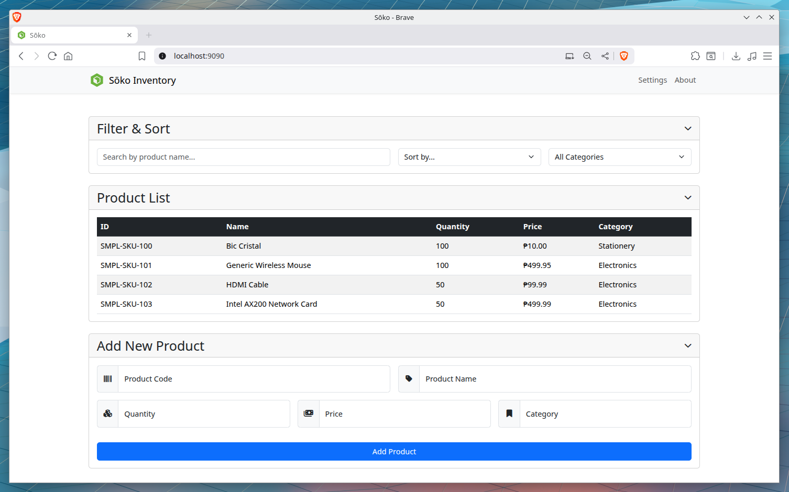

# Sōko

**Sōko** (倉庫) means "warehouse" in Japanese. I'm out of name ideas.



This is a simple, responsive web application for managing a product inventory. It is built with Spring Boot, H2 Database, JavaScript, and Bootstrap 5. The project demonstrates a full-stack application with RESTful API services and a mobile-first user interface.

## Features

- **View Products**: See a complete list of all products in the inventory.
- **Add Products**: Add new products through a simple form.
- **Delete Products**: Remove products from the inventory.
- **Search**: Dynamically search for products by name.
- **Sort**: Sort the product list by ID, name, or price.
- **Filter**: Filter products by category.

## Getting Started

Follow these instructions to get a copy of the project up and running on your local machine.

### Prerequisites

- Java Development Kit (JDK) 17 or later.
- Apache Maven.

### Installation & Running

1.  **Clone the repository:**
    ```sh
    git clone https://github.com/nozomi-75/soko.git
    cd soko
    ```

2.  **Run the application using the Maven wrapper:**

    On macOS/Linux:
    ```sh
    ./mvnw spring-boot:run
    ```

    On Windows:
    ```powershell
    .\mvnw.cmd spring-boot:run
    ```

3.  **Access the application:**
    Open your web browser and navigate to `http://localhost:9090`.

## API Endpoints

The backend exposes RESTful endpoints under the base path `/api/products`. The following sections detail each available endpoint and provide `curl` examples for testing.

---

### `GET /api/products`

Retrieves a list of all products. This endpoint can be used alone to fetch all products or combined with the following query parameters for powerful and flexible queries.

**`curl` Example (Get All):**
```bash
curl -X GET http://localhost:9090/api/products
```

**Query Parameters**

| Parameter   | Example                 | Description                                                                    |
|-------------|-------------------------|--------------------------------------------------------------------------------|
| `name`      | `?name=Book`            | Search for products where the name contains the given string (case-insensitive). |
| `category`  | `?category=Electronics` | Filter products by an exact category match.                                    |
| `minPrice`  | `?minPrice=50`          | Filter for products with a price greater than or equal to this value.          |
| `maxPrice`  | `?maxPrice=200`         | Filter for products with a price less than or equal to this value.             |
| `sortBy`    | `?sortBy=price`         | The field to sort by. Valid options: `id`, `name`, `price`, `quantity`. Defaults to `id`. |
| `sortOrder` | `?sortOrder=desc`       | The sort direction. Valid options: `asc` (default), `desc`.                    |

**Example of a Combined Query**

To find all products in the "Books" category with "Java" in their name, priced under $50, and sorted by price in ascending order, you would use the following request:

**`curl` Example (Combined Query):**
```bash
curl -X GET "http://localhost:9090/api/products?name=Java&category=Books&maxPrice=50&sortBy=price&sortOrder=asc"
```

---

### `GET /api/products/{id}`

Retrieves a specific product by its unique ID.

**`curl` Example (Get Product with ID 1):**
```bash
curl -X GET http://localhost:9090/api/products/1
```

---

### `POST /api/products`

Adds a new product to the inventory. The product details must be provided in the request body as a JSON object.

**`curl` Example:**
```bash
curl -X POST -H "Content-Type: application/json" \
-d '{"itemId": "SKU-101", "itemName": "New Gadget", "itemQty": 50, "itemPrice": 99.99, "itemCategory": "Electronics"}' \
http://localhost:9090/api/products
```

---

### `PUT /api/products/{id}`

Updates the details of an existing product by its ID. The updated product details must be provided in the request body as a JSON object.

**`curl` Example (Update Product with ID 1):**
```bash
curl -X PUT -H "Content-Type: application/json" \
-d '{"itemName": "Updated Gadget", "itemQty": 45, "itemPrice": 95.50, "itemCategory": "Tech"}' \
http://localhost:9090/api/products/1
```

---

### `DELETE /api/products/{id}`

Removes a product from the inventory by its ID.

**`curl` Example (Delete Product with ID 1):**
```bash
curl -X DELETE http://localhost:9090/api/products/1
```
